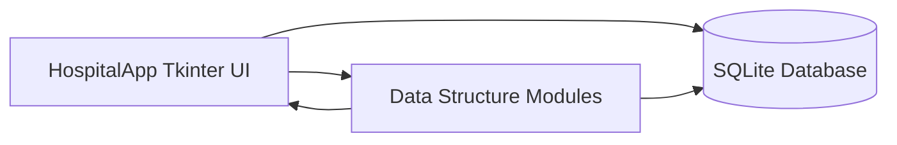
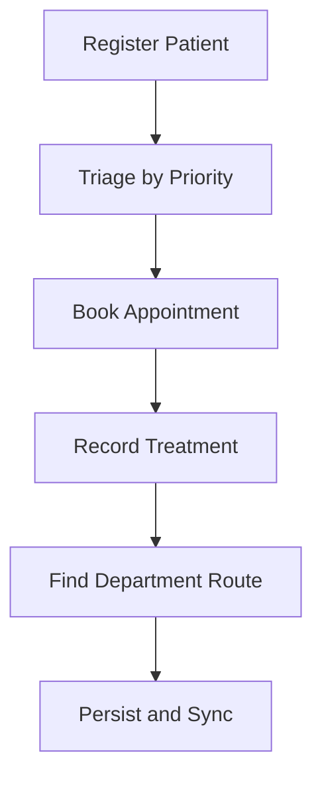

# MediStruct (Kerugoya Hospital Management System)

## Project Overview
MediStruct is a Tkinter-based desktop application for managing core hospital workflows using data structures taught in OOP and DSA.

The system supports:
- Patient registration and lookup
- Triage queue management
- Weekly appointment scheduling
- Treatment history with undo/redo behavior
- Department route planning

Persistence is handled with SQLite so records survive restarts.

## Why These Data Structures

1. Hash Table
- Perfect for fast patient retrieval by unique ID.

2. Priority Queue
- Essential for emergency medical situations where severity must determine order.

3. 2D Array
- Ideal for a fixed weekly schedule with predictable day/slot coordinates.

4. Stack
- Natural fit for undo/redo in treatment record handling.

5. Graph
- Best for mapping hospital layout and shortest department routes.

## Summary Table

| Data Structure | Module | Purpose | Real-world Analogy | Time Complexity |
|---|---|---|---|---|
| Hash Table | Patient Records | Fast patient lookup | Hospital file cabinet with labeled drawers | O(1) average |
| Priority Queue | Triage Queue | Emergency patients first | Emergency room waiting list | O(log n) insertion (conceptual priority queue) |
| 2D Array | Appointments | Fixed schedule grid | Paper appointment book with rows and columns | O(1) slot access |
| Stack | Treatment History | Undo/redo operations | Stack of medical forms | O(1) push/pop |
| Graph | Department Routing | Shortest path finding | Hospital map with connected corridors | O(V^2) in current implementation |

## Visual Architecture





## Key Features

### Patient Registration
- Auto-increment patient IDs (`KGH001`, `KGH002`, ...)
- Contact validation (10-digit input)
- Blood group and allergy capture
- Database persistence

### Triage Queue
- Priority levels: Emergency, Serious, Minor
- Severity-first processing
- Queue overview and service progression

### Appointment Calendar
- 7-day x 10-slot schedule model (08:00-17:00)
- Slot availability checking
- Weekly schedule display

### Treatment History
- Treatment capture by patient
- Doctor attribution and timestamps
- Undo/redo behavior for recent actions

### Patient Lookup
- Search by patient ID or patient name from appointment, treatment, history, billing, and search workflows
- Unified dropdown search improves lookup consistency across the app

### System Settings
- Light/Dark theme support with persistent preference storage
- Default startup tab selection for opening the application on the preferred workflow
- Optional auto backup on exit
- Adjustable UI font size for improved accessibility
- Theme and interface preferences are saved in `system_settings` and applied on startup

### Department Routing
- Shortest path calculation between departments
- Weighted graph representation of movement routes

## Database Overview

Core tables:
- `patients`
- `triage_queue`
- `appointments`
- `treatments`
- `system_settings`

Operational notes:
- Auto-save/sync on normal app close
- Backup support through database utility methods

## Quick Start

### Requirements
- Python 3.7+
- Tkinter (usually bundled with Python)

### Run
```bash
python main.py
```

## Project Structure

```text
MediStruct/
|- main.py
|- database.py
|- hash_table.py
|- priority_queue.py
|- appointment_calendar.py
|- treatment_stack.py
|- hospital_graph.py
|- kerugoya_hospital.db
`- docs/
   |- ARCHITECTURE.md
   |- MODULES.md
   |- DATABASE.md
   |- USER_GUIDE.md
   |- DEVELOPER_GUIDE.md
   |- TROUBLESHOOTING.md
   `- CHANGELOG.md
```

## Full Documentation

- [Architecture](docs/ARCHITECTURE.md)
- [Module Reference](docs/MODULES.md)
- [Database Documentation](docs/DATABASE.md)
- [User Guide](docs/USER_GUIDE.md)
- [Developer Guide](docs/DEVELOPER_GUIDE.md)
- [Troubleshooting](docs/TROUBLESHOOTING.md)
- [Changelog](docs/CHANGELOG.md)

## Academic Assessment Support

- [Lecturer Rubric Alignment](docs/ASSESSMENT_ALIGNMENT.md)

This document maps implementation evidence to common grading criteria, including data structure justification, algorithmic reasoning, OOP design, persistence, documentation quality, and testing strategy.

## Current Constraints

- The application is desktop GUI focused and intended for local execution.
- Main logic and UI orchestration are concentrated in `main.py`.
- Automated tests are not yet included.
