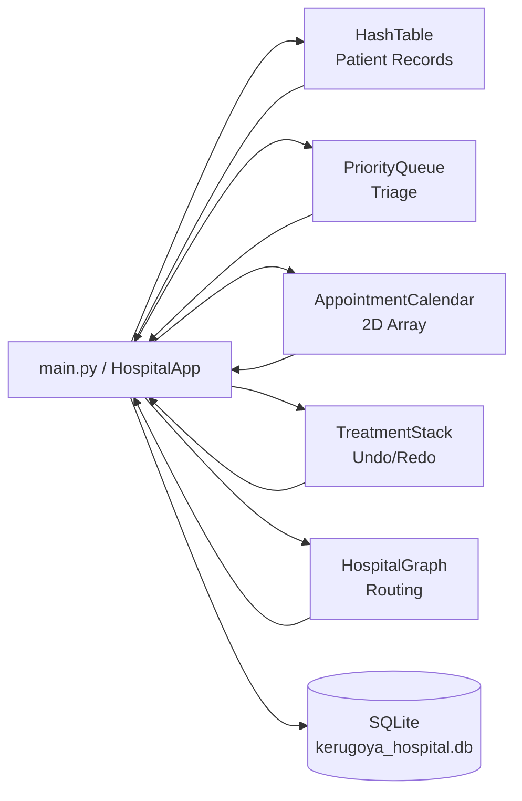
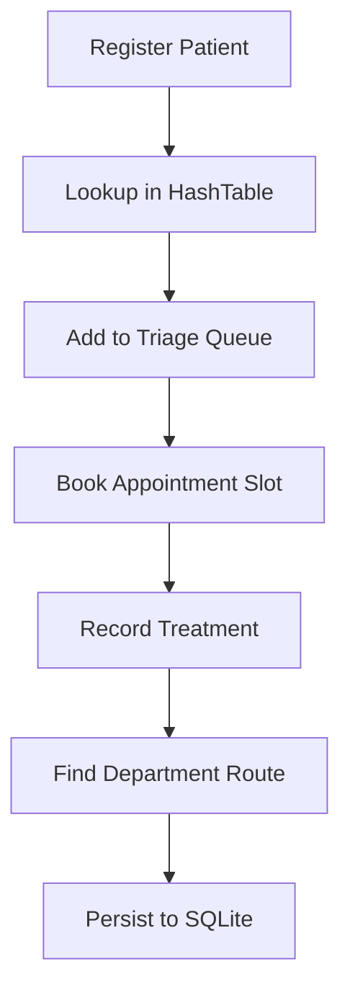

# Architecture

## System Overview
MediStruct is a desktop hospital management application built with Tkinter and SQLite. It combines five core data structures with persistent storage to support daily hospital workflows:

- Patient registration and lookup
- Triage queueing by severity
- Weekly appointment scheduling
- Treatment history with undo/redo behavior
- Department route planning

## Runtime Layers

1. Presentation layer
- Implemented in `main.py` (class `HospitalApp`)
- Tkinter tabs for each business workflow
- Custom UI utilities (`SilentMessageBox`, `ModernButton`)

2. Domain layer
- `hash_table.py`: patient in-memory index
- `priority_queue.py`: triage processing order
- `appointment_calendar.py`: weekly schedule grid
- `treatment_stack.py`: treatment action stack and history
- `hospital_graph.py`: department graph and shortest path

3. Persistence layer
- `database.py` (`HospitalDatabase`)
- SQLite database file: `kerugoya_hospital.db`

## Data Flow

### Startup flow
1. App starts in `main.py`.
2. `HospitalDatabase` initializes DB connection and tables.
3. `HospitalApp.load_from_database()` hydrates in-memory structures.
4. UI tabs are created and displays are refreshed.

### Operational flow
1. User action from UI tab (register, queue, book, treat, route).
2. Domain structure updates in memory for fast interaction.
3. Relevant database operation is called for persistence.
4. UI list/summary components are refreshed.

### Shutdown flow
1. `HospitalApp.on_closing()` triggers sync.
2. Last patient number is saved.
3. DB connection is closed cleanly.

## System Interaction Diagram

## Patient Workflow Diagram

## Why These Five Data Structures

1. Hash Table
- Best fit for frequent patient retrieval by unique ID.
- Average lookup and update performance: O(1).

2. Priority Queue
- Natural model for emergency-first triage.
- Insert/reorder behavior supports urgency-aware processing.

3. 2D Array
- Stable mapping for a fixed week/time-slot grid.
- Constant-time slot checks and updates.

4. Stack
- Correct behavior model for undo/redo operations.
- Last action is reversed first (LIFO).

5. Graph
- Represents departments as connected nodes.
- Supports shortest-path routing between care points.

## Key Design Notes

- In-memory structures optimize UI responsiveness.
- SQLite provides persistence across application runs.
- The architecture balances educational clarity with practical workflow support.
- `main.py` currently contains both UI orchestration and business action handlers; future refactors can split this into service modules.
