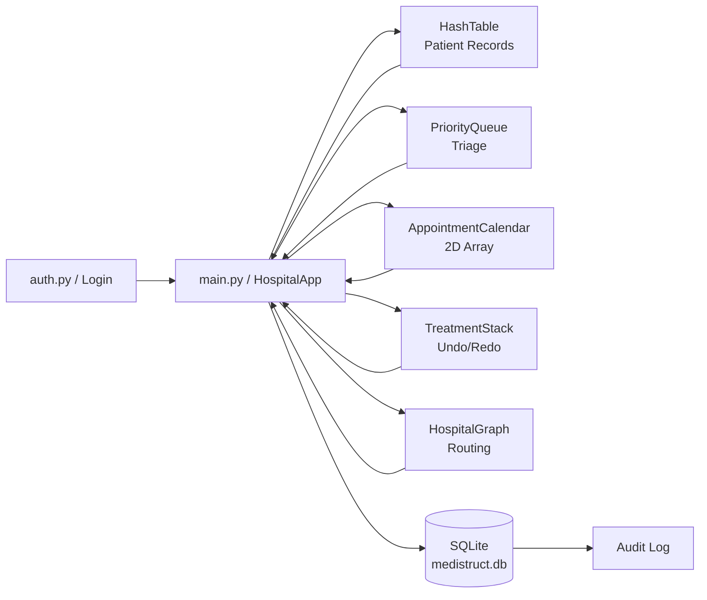
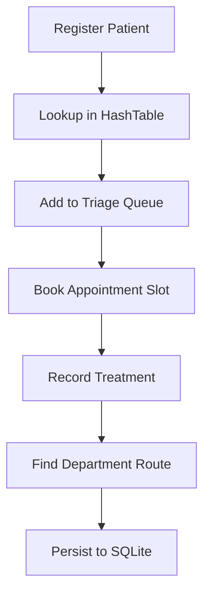

# Architecture

## System Overview
MediStruct is a desktop hospital management application built with Tkinter and SQLite. It combines five core data structures with persistent storage and role-based user access to support daily hospital workflows.

Core workflows include:
- Patient registration and lookup
- Triage queueing by severity
- Weekly appointment scheduling
- Doctor management and billing
- Treatment history with undo/redo behavior
- Department route planning
- Authentication and audit logging

## Runtime Layers

1. Presentation layer
- Implemented in `main.py` (`HospitalApp`)
- Tkinter tabs for each business workflow
- Custom UI utilities (`SilentMessageBox`, `ModernButton`)
- Role-based tab access based on authenticated user

2. Security layer
- `auth.py`: secure staff login, password hashing, roles, and permissions
- User roles: `Admin`, `Doctor`, `Nurse`, `Receptionist`, `Billing`

3. Domain layer
- `hash_table.py`: patient in-memory index
- `priority_queue.py`: triage processing order
- `appointment_calendar.py`: weekly schedule grid
- `treatment_stack.py`: treatment action stack and history
- `hospital_graph.py`: department graph and shortest path

4. Persistence layer
- `database.py` (`HospitalDatabase`)
- SQLite database file: `medistruct.db`
- Tables include `patients`, `triage_queue`, `appointments`, `treatments`, `doctors`, `bills`, `users`, `system_settings`, and `audit_log`

## Data Flow

### Startup flow
1. App starts in `main.py`.
2. `HospitalDatabase` initializes DB connection, creates tables, and ensures default records.
3. Login screen prompts staff credentials.
4. `HospitalApp.load_from_database()` hydrates in-memory structures.
5. UI tabs are created based on authenticated user role.

### Operational flow
1. User action from a workflow tab.
2. Domain structure updates in memory for fast interaction.
3. Relevant database operation is called for persistence.
4. UI list/summary components are refreshed.
5. Audit entries record login and management events.

### Shutdown flow
1. `HospitalApp.on_closing()` triggers sync.
2. Last patient number and settings are saved.
3. DB connection is closed cleanly.

## System Interaction Diagram

## Patient Workflow Diagram

## Why These Five Data Structures

1. Hash Table
- Best fit for frequent patient retrieval by unique ID.
- Average lookup and update performance: O(1).

2. Priority Queue
- Natural model for emergency-first triage.
- Insert/reorder behavior supports urgency-aware processing.

3. 2D Array
- Stable mapping for a fixed week/time-slot grid.
- Constant-time slot checks and updates.

4. Stack
- Correct behavior model for undo/redo operations.
- Last action is reversed first (LIFO).

5. Graph
- Represents departments as connected nodes.
- Supports shortest-path routing between care points.

## Key Design Notes

- In-memory structures optimize UI responsiveness.
- SQLite provides persistence across application runs.
- `auth.py` handles login, roles, and permissions.
- Audit logging captures important user actions.
- `main.py` currently contains both UI orchestration and business action handlers; future refactors can split this into service modules.
